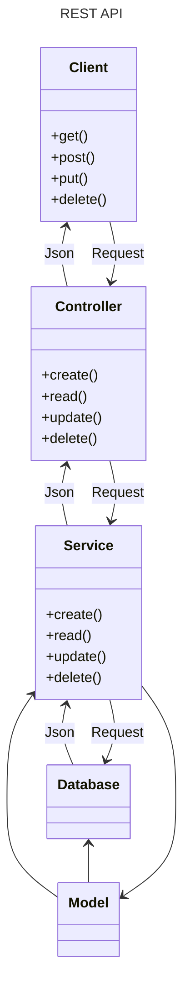
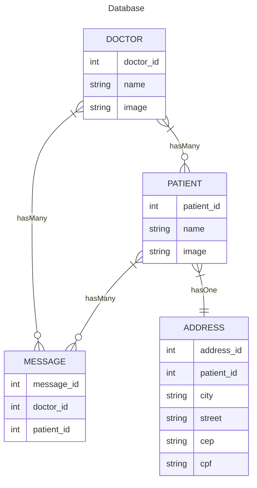

# Doctorcare backend

## PROJECT STRUCTURE

```mermaid
---
title: REST API
---
classDiagram
   Client <-- Controller : Json
   Controller <-- Client : Request
   Controller <-- Service : Json
   Service <-- Controller : Request
   Service <-- Database : Json
   Service <-- Model
   Model <-- Service
   Database <-- Service : Request
   Database <-- Model

   class Client {
    +get()
    +post()
    +put()
    +delete()
   }

   class Controller {
     +create()
     +read()
     +update()
     +delete()
   }

   class Service {
     +create()
     +read()
     +update()
     +delete()
   }
```

## ENTITY RELATIONSHIP DIAGRAM

```mermaid
---
title: Database
---
erDiagram
    DOCTOR }|--o{ PATIENT : hasMany
    DOCTOR }|--o{ MESSAGE : hasMany
    PATIENT }|--o{ MESSAGE : hasMany
    PATIENT }|--|| ADDRESS : hasOne

    DOCTOR {
        int doctor_id
        string name
        string image
    }

    PATIENT {
        int patient_id
        string name
        string image
    }

    ADDRESS {
        int address_id
        int patient_id
        string city
        string street
        string cep
        string cpf
    }

    MESSAGE {
        int message_id
        int doctor_id
        int patient_id
    }
```
